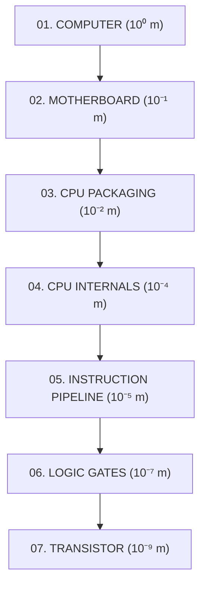

# ⚡ INSIDE THE MACHINE
### *A Scroll-Driven 3D Journey from a Computer to an Atomic Transistor*

**[🚀 Live Demo](https://inside-the-machine-one.vercel.app/)** • **[📖 Documentation](#-the-7-computational-layers)** • **[🕹️ Interactive Sandboxes](#-interactive-sandboxes--simulations)** • **[🛠️ Architecture](#-project-architecture)**

---

## 💡 The Core Concept

**Inside the Machine** is a scrollytelling WebGL 3D educational experience. As the user scrolls down the page, the camera plunges from the macroscopic view of an open computer chassis down into silicon microarchitecture, logic gates, and ultimately a single nanoscale transistor switch.

The entire experience communicates one fundamental principle:
> **Every piece of modern software — from simple calculators to planetary-scale AI models — emerges entirely from billions of tiny electronic switches flipping between ON ($1$) and OFF ($0$).**

---

## 🌌 The 7 Computational Layers

