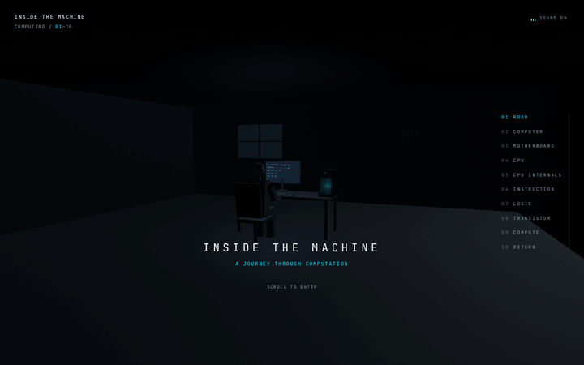

# INSIDE THE MACHINE
### A Scroll-Driven 3D Journey from a Computer to an Atomic Transistor

**Live Demo:** https://inside-the-machine-one.vercel.app/

## Key Features

No VR Equipment Required: Runs in modern desktop and mobile browsers. No headsets, no installs, no accounts.

Scroll-Driven 3D Cinematography: Scrolling moves the camera from a quiet desk down through the machine, revealing each layer one by one. The return trip ends where it started.

10 Core Educational Sections:

Introduction: A dark room, late at night. A person types at a desk. The journey happens between two keystrokes.

Computer: The camera dives through the case vent, into the box that does the work.

Motherboard: Copper traces connect every part. Tap a component to see what it does.

CPU: A square of silicon smaller than a stamp, reading the program billions of times a second.

CPU Internals: Control unit directs traffic, the ALU does the maths, registers and cache keep data close.

Instruction: One instruction, ADD. Fetch, decode, execute, write back.

Logic Gates: AND, OR and NOT gates with flippable inputs. Real boolean logic, computed live.

Transistor: The switch behind every gate, flipped by voltage instead of fingers.

Compute: A real 4-bit ripple-carry adder. Set two numbers, watch the carry ripple bit by bit. Nothing is hardcoded.

Return: Back up through the gates, the core, the board, the vent. The person is still typing.

Procedural 3D: Room, desk, PC, motherboard, CPU and gates are built in code with A-Frame and Three.js. Zero external 3D assets.

Interactive Click and Touch Inspection: Click or tap any glowing part to open its info card.

Synthesized Sound: Startup hum, room tone, ambient pad, UI clicks and gate blips, all generated live with the Web Audio API. No audio files.

Quiz Mode: Five questions that test what the journey taught you, scored in the HUD.

Stage Rail: Jump straight to any layer from the side rail.

## Mobile and Tablet Features

Touch Scrolling: Native vertical scrolling with momentum drives the camera, same as desktop.

Mobile Notice: Phones see a short waiting screen suggesting a PC for the best experience, then continue.

Responsive HUD: Captions, panels and the stage rail adapt to small screens.

## Controls and Navigation

| Action | Desktop | Mobile and Tablet |
|---|---|---|
| Travel | Mouse wheel or scroll | Touch scroll |
| Select part | Click the part | Tap the part |
| Flip gate inputs | Click | Tap |
| Restart | EXPLORE AGAIN button | EXPLORE AGAIN button |
| Mute | Speaker button | Speaker button |

## Easter Egg

Enter the Konami code anywhere on the site.

## Tech Stack

Framework: TanStack Start with React 19 and TypeScript

3D Engine: A-Frame and Three.js

Styling: Tailwind CSS

Audio: Web Audio API, fully synthesized

## Getting Started

Prerequisites: Node.js v18 or newer, bun

Clone: git clone https://github.com/p3xz/inside-the-machine.git

Install: bun install

Development: bun run dev

Production build: bun run build

## License

MIT
